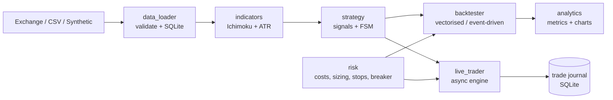

# Crypto Algo Trading & Backtesting System

An end-to-end quantitative trading system for **cryptocurrency markets** built around the
**Ichimoku Kinko Hyo** strategy, extended with the full "Crypto Trading
Strategies: Intermediate and Advanced"  (calendar anomalies, Aroon/RSI
divergence, K-Means asset clustering, cointegrated pairs trading, Hurst-exponent regime
filtering, long-only momentum / alpha portfolios). It covers data ingestion, vectorised
and event-driven backtesting with realistic execution costs, risk management,
performance analytics and charts, and an asynchronous real-time engine that trades
automatically in **paper**, **demo (exchange testnet)** or **real** mode.

Crypto data comes live from Binance (CCXT); backtests run on exchange, synthetic or CSV
data offline.

```
Data fetch (CCXT / SQLite) -> Signals (Ichimoku + overlays + ML strategies) -> Backtests (vectorised + event-driven)
        -> Analytics & charts -> Real-time engine (paper / demo / real)
```

> Educational software. Nothing here is investment advice, and past or simulated
> performance says nothing about future results. Paper-trade first; if you ever use real
> money, start with a small amount you can afford to lose.

---

## 1. Project layout

| File | Responsibility |
|---|---|
| `config.py` | Frozen dataclass configuration (exchange, data, strategy, costs, risk, backtest, live), Ichimoku presets, course-aligned strategy params, env/`.env` secrets, JSON-lines structured logging |
| `data_loader.py` | CCXT paginated OHLCV download with retry/back-off, validation and gap report, SQLite cache (idempotent upsert, incremental refresh), CSV/Parquet, synthetic regime-switching GBM generator |
| `indicators.py` | Vectorised Ichimoku (all five lines + Kumo + projection), Wilder ATR (TA-Lib if installed), RSI + causal RSI divergence, Aroon, Bollinger, rescaled-range Hurst exponent, ADF test (statsmodels), volatility-regime adaptive Ichimoku |
| `strategy.py` | Ichimoku signal rules (long / short / exit), vectorised position state machine, latest-bar snapshot for live trading |
| `intermediate_strategies.py` | "Intermediate": Ichimoku (re-export), **Calendar Anomalies** (hour / day-of-week seasonality), **Aroon / RSI Divergence** |
| `advanced_ml_strategies.py` | "Advanced": **K-Means asset clustering** (scikit-learn or scipy fallback), **Hurst-exponent** trend regime + RSI filter, **long-only momentum / alpha** cross-sectional portfolio, pairs re-export |
| `momentum.py` / `pairs.py` | Time-series momentum strategy; cointegrated pairs trading (rolling OLS hedge, spread z-score) |
| `risk.py` | Cost model (0.1% fees, spread, slippage, square-root impact), fixed-fractional & Kelly sizing, ATR/Kumo stops, trailing stops, intrabar fill rules, circuit breaker. Shared by backtester and live engine |
| `backtester.py` | `VectorizedBacktester`, `EventDrivenBacktester`, preset comparison, in-sample/out-of-sample `ParameterOptimizer` |
| `analytics.py` | Sharpe, Sortino, Calmar, drawdown depth/duration, PSR, VaR/CVaR, alpha/beta, trade statistics, and all Matplotlib charts |
| `live_trader.py` | asyncio engine: ccxt.pro WebSocket / REST / replay feeds, paper (order-book walking) and live (CCXT) execution, SQLite trade journal |
| `live_paper_trader.py` | Spec-facing facade re-exporting the real-time engine (WebSockets + paper simulator + CCXT live templates) |
| `main.py` | Interactive menu and CLI sub-commands for the whole pipeline |
| `tests/test_core.py` | 22 tests, including look-ahead-bias checks and a backtest-vs-live parity test |



## 2. Setup

```bash
python -m pip install -r requirements.txt
```

A virtual environment (`python -m venv .venv`) is optional; see the Windows note below before
using one.

* `ccxt` is required for anything that talks to an exchange: downloading real data, and the paper,
  demo and real trading modes. Backtests on `--source synthetic` / `--source csv` and the offline
  replay work without it.
* Optional extras: `TA-Lib` (C-speed rolling extremes and ATR; the NumPy/pandas fallback gives
  identical numbers) and `pyarrow` (Parquet export).
* **Windows troubleshooting.** *"DLL load failed ... An Application Control policy has blocked
  this file"* means Windows Smart App Control rejected a newly downloaded native library (numpy,
  pyarrow, ...). It is not a bug in this project.
  * Inside a virtual environment: leave it (`deactivate`) and use the Python installation whose
    packages already load. Fresh copies in a new venv are often the ones that get blocked.
  * If only pyarrow is blocked: `python -m pip uninstall -y pyarrow` (it is optional here).
  * If a package cannot be loaded at all, run the project under WSL (Ubuntu on Windows) or on a
    Linux server, where Smart App Control does not apply.

  `main.py` detects this error and prints these hints.

## 3. Quick start

```bash
python main.py                                         # interactive menu
python main.py pipeline --source synthetic             # full pipeline offline, no exchange needed
python main.py pipeline                                # same on real Binance BTC/USDT 1h data
python main.py fetch --symbol ETH/USDT --timeframe 15m --days 180
python main.py backtest --preset crypto --sizing kelly --stop cloud --trailing kijun
python main.py compare                                 # standard vs crypto vs crypto_slow vs dynamic
python main.py optimize --metric sharpe                # IS/OOS grid search + heatmap
python main.py live                                    # paper trading on live market data
python main.py live --source synthetic --replay-bars 800   # offline paper-trading replay
python main.py momentum --source synthetic                      # momentum backtest
python main.py calendar --source synthetic                      # calendar-anomaly backtest
python main.py divergence --source synthetic                    # Aroon / RSI divergence backtest
python main.py hurst --source synthetic                         # Hurst-exponent regime filter + RSI
python main.py portfolio --source synthetic                     # K-Means clustering + momentum-alpha portfolio
python scripts/compare_all.py --symbol BTC/USDT                 # all-strategy scorecard + equity chart
```

Useful flags: `--allow-short` (derivatives / margin only), `--cross-lookback N`, `--no-chikou`,
`--kumo-twist`, `--capital`, `--risk-per-trade`, `--max-dd`, `--fee`, `--slippage-bps`,
`--timeframe`, `--flatten-on-exit`, `--no-plots`, `--show`. Run `python main.py <command> -h` for
the full list.

Outputs go to `reports/<SYMBOL>_<TF>_<source>/`: the text/JSON report, equity-curve and trade
CSVs (the table view behind every chart), configuration metadata and PNG charts. Logs are
JSON lines in `logs/trading_bot.jsonl`; live fills, trades and equity go to
`data/trade_journal.sqlite`.

## 4. Trading modes

**"Live" means real-time, not real money.** The real-time engine runs in one of three modes, and
real money is only used when you explicitly configure it.

| Mode | What happens | Program must keep running | Account / API keys | Real money |
|---|---|---|---|---|
| Backtest | Replays history, results in seconds | No | None | No |
| **Paper** (default) | Real market prices, simulated fills and balance | Yes | None | No |
| **Demo** | Real orders on Binance Spot Testnet, with testnet funds | Yes | Testnet keys | No |
| **Real** | Real orders on your Binance account | Yes | Real keys | **Yes** |

### 4.1 Choosing the mode

The mode is set by `--mode` (or `TRADING_MODE` in `.env`), and demo vs real by
`EXCHANGE_USE_TESTNET` in `.env`:

| Mode | `.env` | Command |
|---|---|---|
| Paper | nothing needed | `python main.py live` |
| Demo | testnet keys, `EXCHANGE_USE_TESTNET=true` | `python main.py live --mode LIVE_TRADING` |
| Real | real keys, `EXCHANGE_USE_TESTNET=false` | `python main.py live --mode LIVE_TRADING` |

Demo and real use the same command; only the keys and `EXCHANGE_USE_TESTNET` differ. At start-up
the console shows **TESTNET** or **MAINNET - REAL MONEY**, and you must type `I UNDERSTAND` to
continue. The interactive menu (option 5) uses `TRADING_MODE` from `.env`, and runs paper trading
if it is not set.

Real money needs all three of: real API keys in `.env`, `EXCHANGE_USE_TESTNET=false`, and the
typed confirmation. Remove any one of them and no real order can be sent.

### 4.2 What the bot does automatically

Once started, no manual action is needed. On every closed candle the bot computes the Ichimoku
signals and buys or sells by itself, sizing each position from your risk settings. It watches
stop-loss and take-profit on every order-book update, enforces the drawdown circuit breaker, and
records every fill and trade in the journal.

It trades only while the program is running. If the computer sleeps or the program stops, trading
stops, and so do the stop-losses, because stops are managed by the bot rather than placed on the
exchange. For long unattended runs, use a cloud server (VPS). Stop with `Ctrl+C`; add
`--flatten-on-exit` to close any open position on shutdown.

Signals use closed candles, so with 1h candles the first decision arrives when the current hour
closes. For a quicker demo use `--timeframe 5m` or `15m`, keeping in mind that the timeframe
changes the strategy's behaviour.

### 4.3 Paper trading (no account)

```bash
python main.py live
```

Uses live Binance market data and simulates each market order by walking the real order book.

### 4.4 Demo account: Binance Spot Testnet

1. Open https://testnet.binance.vision, choose **Log In with GitHub**, then **Generate
   HMAC_SHA256 Key**. Copy the API key and secret; the secret is shown only once. The testnet
   account comes with test balances.
2. Copy `.env.example` to `.env` and fill in:
   ```ini
   EXCHANGE_API_KEY=your_testnet_api_key
   EXCHANGE_API_SECRET=your_testnet_secret
   EXCHANGE_USE_TESTNET=true
   ```
3. Run `python main.py live --mode LIVE_TRADING --flatten-on-exit` and type `I UNDERSTAND`.

Testnet prices and liquidity differ from the real market, so fill prices there can look odd. Use
the demo to confirm that orders are placed, filled and journaled correctly, and use paper mode
to judge execution quality (section 5).

### 4.5 Real account

Do this only after paper and demo have run correctly for a while. Demo is not technically
required, but it catches problems with test funds instead of real ones.

1. Complete KYC on your Binance account.
2. **Profile -> API Management -> Create API**:
   * **Enable Spot & Margin Trading:** on.
   * **Enable Withdrawals:** always off. A leaked key then cannot move funds out.
   * Restrict the key to your IP address if you have a fixed IP.
3. Put the real keys in `.env` and set `EXCHANGE_USE_TESTNET=false`.
4. Use a dedicated sub-account holding only the trading capital, and start small (for example
   50-100 USDT). The bot sizes positions from the account's USDT + BTC balance, buys only with
   free USDT, and caps every order at `max_order_notional` (1,000 USDT by default, `config.py`).
5. Run `python main.py live --mode LIVE_TRADING --flatten-on-exit`. The banner must say
   **MAINNET - REAL MONEY**.

Keep API keys only in `.env` (git-ignored), never share or paste them anywhere, and check your
local tax rules before trading real funds (in India, for example, crypto gains are taxed at 30 %
with 1 % TDS).

## 5. Validating the results

Backtests and the demo account answer different questions.

**Is the backtest computed correctly?** This needs historical data only, no account:
* The test suite checks accounting identities, the absence of look-ahead, textbook Ichimoku values
  and the cost model (section 9).
* Manual cross-check for a report or viva: take 5-6 trades from the trades CSV, open the same
  symbol and timeframe on TradingView with Ichimoku (9, 26, 52, 26), and confirm each entry had
  price above the Kumo, a fresh Tenkan/Kijun cross and Close above the close 26 bars earlier.

**Does the same strategy behave the same in real time?** This is *forward testing* with paper or
demo mode:
1. Run the bot in paper (or demo) mode for a few weeks; every trade is saved in the journal.
2. Run the backtest over the same period.
3. Compare trade by trade. Entry and exit times should match; small price differences are slippage.

The same comparison is automated offline: `test_live_replay_reproduces_the_event_driven_backtest`
streams bars through the real engine and gets exactly the backtester's trades. With 1h candles
the strategy trades roughly once a week, so collecting 20-30 live trades takes one to two months.

## 6. Strategy

With HH_n / LL_n the highest high / lowest low of the last n bars:

| Line | Formula | Plotted |
|---|---|---|
| Tenkan-sen | (HH_9 + LL_9) / 2 | at t |
| Kijun-sen | (HH_26 + LL_26) / 2 | at t |
| Senkou Span A | (Tenkan + Kijun) / 2 | 26 bars ahead |
| Senkou Span B | (HH_52 + LL_52) / 2 | 26 bars ahead |
| Chikou Span | Close_t | 26 bars behind |

**Rules** (evaluated on the close of bar t, executed at the open of t+1):

* **Long entry:** Close > Kumo top **and** Tenkan crosses above Kijun **and** Close_t > Close_{t-26} (Chikou confirmation). An optional Kumo-twist filter is available.
* **Long exit:** Close < Kumo bottom **or** Tenkan crosses below Kijun.
* **Short entry / exit:** exact mirror (enabled with `--allow-short`, derivatives / margin only).

**Look-ahead bias.** The cloud visible at bar t is the span computed at t-26
(`senkou_a = senkou_a_lead.shift(26)`). The Chikou line drawn at t is *future* data
(Close_{t+26}), so it is used for plotting only. "Chikou above price" is evaluated causally
as Close_t > Close_{t-26}. A unit test proves that signals computed on truncated history equal
signals computed on the full history.

**Presets.** `standard` 9/26/52/26 (Hosoda's six-day trading week), `crypto` 10/30/60/30
(the same calendar logic on a 24/7 market), `crypto_slow` 20/60/120/30 (doubled, fewer
whipsaws). **`dynamic`** classifies each bar by the rolling percentile of NATR = ATR/Close:
low volatility uses fast lines, normal uses crypto lines, high volatility uses slow lines.
TK "crosses" caused purely by a regime switch are ignored.

## 7. Backtesting

* **Vectorised:** `r_strat = position.shift(1) * r - |Δposition| * c`. Full notional, proportional
  costs, no stops. It runs in milliseconds and drives the optimiser. Because crypto trades 24/7
  (next open ≈ last close), trading at the signal bar's close is equivalent to the next open.
* **Event-driven:** a bar-by-bar loop that mirrors the live engine. Orders fill at the next open,
  positions are risk-sized, stops and targets are checked inside each bar, trailing stops ratchet,
  shorts pay financing, and the circuit breaker is enforced. Two conservative OHLC rules apply:
  a gap through a stop fills at the open, and if a stop and a target are both inside one bar the
  stop is assumed to have been hit first.

**Execution costs**: `P_fill = P * (1 ± (half_spread + slippage + Y·σ_bar·√(Q/V_bar)))`, where the
last term is the square-root market-impact law. Fees are 0.1 % taker / maker by default.

**Risk management**

* Fixed-fractional sizing: `Q = f·E / |P_entry − P_stop|`, capped at `max_position_pct·E / P`.
* Kelly: `f* = W − (1 − W)/R` from the last N trades' R-multiples, half-Kelly, capped. Before
  enough trades exist it falls back to fixed fractional.
* Stops: ATR (`entry ∓ k·ATR`) or Kumo (far cloud edge ∓ buffer), with take-profit at an ATR multiple
  or a reward:risk multiple. Trailing: Chandelier (ATR) or Kijun-sen.
* Circuit breaker: flatten and halt at a 20 % drawdown from the high-water mark (cool-down, then
  the mark resets) and at a 5 % daily loss.

**Analytics**: total and annualised return, volatility, Sharpe, Sortino, Calmar, max drawdown and its
duration, Probabilistic Sharpe Ratio, skew/kurtosis, VaR/CVaR, alpha/beta/information ratio vs buy &
hold, win rate, profit factor, payoff, expectancy, R-multiples, trade durations, exit reasons, fees and
slippage paid. Annualisation uses 365 × 24 × 60 / bar-minutes periods, because crypto never closes.

**Charts**: Ichimoku candlestick chart with projected Kumo and buy/sell markers, full-period
overview, performance dashboard (cumulative return vs benchmark, equity curve, underwater chart,
monthly heatmap, trade distribution), trade analysis (rolling Sharpe, cumulative PnL, exit reasons,
R-multiples), optimisation heatmaps (in-sample vs out-of-sample), and preset comparison. The
palette was checked for colour-blind separation, and buy/sell markers differ by shape as well as
colour.

## 8. Real-time engine

```
feed (ccxt.pro WS | REST | replay) --bars (FIFO queue)--------> strategy task --+
                                   --order book (mailbox)-----> risk monitor ---+--> Paper | Live execution
heartbeat / watchdog (loop lag, stale feed)                           trade journal (SQLite)
```

* **No event-loop starvation.** Closed bars use a lossless queue. Order-book and tick bursts go
  through a latest-value mailbox (O(1) memory, never a backlog). pandas work runs in
  `asyncio.to_thread`, as do SQLite writes. Every wait has a timeout. A heartbeat measures
  loop lag, and streams reconnect with exponential back-off and jitter.
* **Signals use closed candles only** (no repainting), computed with exactly the strategy code
  the backtests use. Stops are monitored on every order-book update, with a bar-level safety net.
* **Paper mode** fills market orders by walking the live order book (VWAP over the consumed levels).
* **Live mode (demo and real)** uses CCXT with exchange precision and minimum checks, a hard
  per-order notional cap, client order ids with reconciliation after network errors, and a typed
  confirmation before start. Positions are recorded **net of exchange fees**: Binance charges
  spot fees in the asset received, so a 0.01 BTC buy credits 0.00999 BTC, and the bot never tries
  to sell more than the account holds. Buys are capped by the free quote balance.
* **Replay feed** streams historical bars (with an interpolated intrabar path) through the
  *real* engine; the parity test uses it.

## 9. Tests

```bash
python -m pytest
```

The 22 tests cover textbook Ichimoku values, the TA-Lib-compatible Wilder ATR, the absence of
look-ahead (static and dynamic modes), the position state machine, the cost model and its
direction, both position sizers, intrabar stop/target rules, trailing-stop ratcheting, the
circuit breaker, event-driven accounting identities (`equity = cash + side·qty·close`,
Σ trade PnL = equity change), vectorised timing, metric formulas, trade statistics, data
validation, the SQLite and CSV round trips, order-book walking, fee-adjusted live fills, CLI
config parsing, and **live-replay vs backtest parity**.

## 10. Status, limitations and next steps

* **Exchange connectivity has been validated against Binance.** Real 365/730-day OHLCV history
  downloads (REST), the live WebSocket feed, warm-up, and the real-time engine all run. Paper
  trading (order-book walking) and Binance Spot Testnet orders were exercised end-to-end, including
  fee-adjusted fills and the SQLite trade journal. Real mainnet orders have not been run; only
  testnet funds should be used until the strategy itself is proven.
* **Backtest results on real data are currently negative.** As of the last verified runs, the
  long-only preset variants lost money on BTC/USDT 1h and ETH/USDT 1h (profit factors 0.4-0.7) and
  barely traded on BTC 1d, in a period where buy-and-hold rose. The in-sample parameter optimiser
  winner overfits (IS Sharpe ~0.49 collapses to OOS ~-2.7). Treat the system as validated plumbing
  with an unvalidated strategy; forward-test in paper/demo before any real funds.
* Synthetic data exists to test the software. Judge the strategy only on real exchange data,
  and look at the out-of-sample columns rather than the best in-sample cell.
* A correctly working bot is not a profitable one; profitability comes only from real-data
  backtests and forward testing.
* OHLC bars hide the intrabar path; the backtest fill rules are deliberately pessimistic.
* Stops are client-side (they stop if the bot stops). Perpetual-futures funding is approximated
  by a constant borrow rate.
* Possible extensions: a `reconcile` command comparing journal trades with a backtest of the same
  period, walk-forward optimisation, multi-asset portfolios, exchange-native OCO/stop orders, and a
  C++20 kernel (monotonic-deque rolling extremes) exposed through pybind11 for high-frequency
  timeframes.
